# Multica / Omnigent Agent 架构复盘

日期：2026-06-30

这份笔记是这几天一起看 Multica 和 Omnigent 时形成的架构地图。重点不是“怎么点 UI”，而是把下面这些问题串起来：

- Multica 里 agent 为什么能像人一样成为 issue assignee。
- issue / comment 是怎么变成 `agent_task_queue` 任务的。
- daemon / runtime / agent 的比例和边界在哪里。
- Multica 现在直接驱动 CLI 的优缺点。
- Omnigent 的 Harness / Executor / Event / Policy 抽象解决了什么。
- 如果 Multica 要升级成多 harness、多 runtime、多 agent 编排平台，还缺哪些层。

## 0. 一句话总览

Multica 现在更像“任务管理系统 + 本地 daemon 执行器”：server 负责 issue、权限、队列、状态，daemon 负责 claim task 后启动具体 agent CLI。

Omnigent 更像“agent harness runtime 平台”：server / runner / harness / executor / policy / event 被拆得更细，适合统一不同 agent 后端、统一工具审批、统一 trace、统一多 agent 编排。

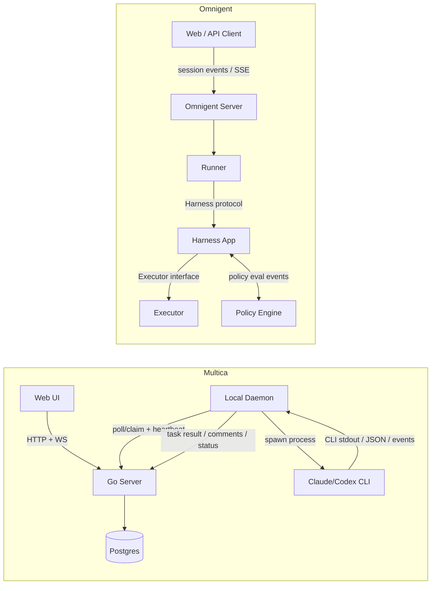

## 1. Multica 核心领域模型

### 1.1 Agent 是 issue assignee 的一种

Multica 的 issue assignee 不是单一外键，而是：

- `assignee_type`
- `assignee_id`

见：

- `server/migrations/001_init.up.sql`
- `server/migrations/084_squad.up.sql`
- `server/pkg/db/generated/models.go`
- `server/internal/handler/issue.go`

设计意图：

- 允许 assignee 指向 `member`、`agent`、后来新增的 `squad`。
- 避免为每种 assignee 类型拆不同列，例如 `member_assignee_id`、`agent_assignee_id`、`squad_assignee_id`。
- 牺牲数据库层强外键，换取产品模型扩展性。
- 校验责任上移到 handler/service，比如 `validateAssigneePair`。

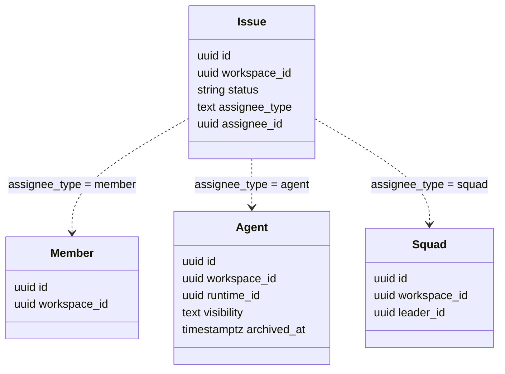

伪代码：

```go
func validateAssigneePair(issue) error {
    if assignee_type == nil && assignee_id == nil {
        return nil // unassigned
    }
    if onlyOneOf(type, id) {
        return badRequest("assignee_type and assignee_id must be paired")
    }

    switch assignee_type {
    case "member":
        require member exists in workspace
    case "agent":
        require agent exists in workspace
        require not archived
        require private-agent access
    case "squad":
        require squad exists in workspace
        require leader exists / visible
    default:
        reject
    }
}
```

这里对应 `CLAUDE.md` 的 UUID 规则：handler 写路径必须知道 UUID 来源。路径参数走 loader，request body 纯 UUID 用 `parseUUIDOrBadRequest`，SQL round-trip 才能用 `parseUUID`。这条规则主要防止“用户传了一个合法 UUID 字符串，但不是当前 workspace 资源”的越权坑。

### 1.2 agent / runtime / daemon 的比例

今天我们看到的关键点：

- `agent` 是产品里的虚拟同事，可以被分配 issue。
- `agent_runtime` 是一个可执行环境，例如本地 codex runtime、本地 claude runtime、云 runtime。
- `daemon` 是本机进程，它注册多个 runtime，并帮这些 runtime claim task。
- 一个 daemon 可以管理多个 provider/runtime，例如 codex、claude。
- 一个 agent 通过 `runtime_id` 绑定到某个 runtime。
- 多个 agent 理论上可以绑定同一个 runtime，但实际并发、隔离、模型和工作目录策略要小心。

`server/migrations/004_agent_runtime_loop.up.sql` 里有：

```sql
CREATE TABLE agent_runtime (
    id UUID PRIMARY KEY DEFAULT gen_random_uuid(),
    workspace_id UUID NOT NULL REFERENCES workspace(id) ON DELETE CASCADE,
    daemon_id TEXT,
    name TEXT NOT NULL,
    runtime_mode TEXT NOT NULL CHECK (runtime_mode IN ('local', 'cloud')),
    provider TEXT NOT NULL,
    status TEXT NOT NULL DEFAULT 'offline',
    ...
    UNIQUE (workspace_id, daemon_id, provider)
);
```

这里的 `provider` 不是“创建 runtime 的人”，而是 runtime 后端类型，例如 `codex`、`claude`、`legacy_local`、`multica_agent`。真正和用户/owner 相关的是 runtime 注册、token、workspace member，以及任务 claim 时注入的 `RequestingUser` / `Initiator` / `AuthToken` 等字段。

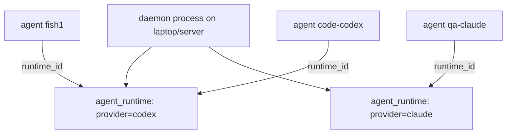

## 2. Issue 创建 / 更新触发 agent

### 2.1 `WillEnqueueRun` 是“写 issue 是否启动 run”的统一判定

位置：

- `server/internal/service/issue_trigger.go`
- `server/internal/handler/issue.go`
- `server/internal/handler/issue_trigger.go`

核心判断：

- create 或 assignee changed，并且 status 不是 `backlog`，会触发 assign-source run。
- status 从 `backlog` 变成 active 状态，会触发 status-source run。
- assignee 是 agent：检查 agent runtime、archived、可见性、pending task。
- assignee 是 squad：实际执行者是 squad leader。

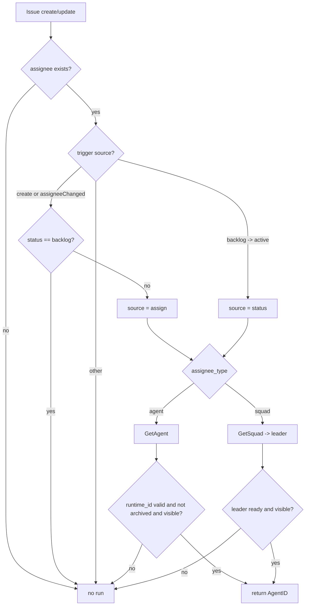

伪代码：

```go
func WillEnqueueRun(ctx, input, probe) (trigger, ok) {
    issue := input.Issue
    if no assignee {
        return false
    }

    switch {
    case input.IsCreate || input.AssigneeChanged:
        if issue.Status == "backlog" {
            return false
        }
        source = "assign"

    case input.StatusChanged && input.PrevStatus == "backlog" && issue.Status not terminal:
        if probe.IsSelfLoop() {
            return false
        }
        source = "status"

    default:
        return false
    }

    switch issue.AssigneeType {
    case "agent":
        agent := GetAgent(issue.AssigneeID)
        require agent.RuntimeID.Valid
        require not archived
        require canAccessAgent(agent)
        if source == "status" {
            require no pending run
        }
        return trigger(agent.ID)

    case "squad":
        squad := GetSquad(issue.AssigneeID)
        leader := GetAgent(squad.LeaderID)
        require AgentReadiness(leader)
        require canAccessAgent(leader)
        return trigger(leader.ID)
    }
}
```

调试注意：`WillEnqueueRun` 使用的是 `r.Context()`。如果你在断点停太久，请求 context 会被浏览器/前端取消，后面的 `GetAgent(ctx, ...)` 看起来就会像 DB 超时。这不是 SQL 本身慢，而是调试时把 HTTP request 卡住了。

### 2.2 issue task 入队以后怎么防重复 claim

任务表：

- `agent_task_queue`
- 状态：`queued`、`dispatched`、`running`、`completed`、`failed`、`cancelled`，后来还有 `waiting_local_directory` 等扩展状态。

claim SQL：

- `server/pkg/db/queries/agent.sql`
- `ClaimAgentTask`

关键点：

- `FOR UPDATE SKIP LOCKED` 保证多个 daemon / 多个 poller 同时 claim 时不会拿到同一行。
- `NOT EXISTS active task` 保证同一个 agent 对同一个 issue 不会并行跑重复任务。
- 不同 agent 可以对同一个 issue 并行。
- chat task 用 `chat_session_id` 序列化。
- quick-create 任务按“无 issue/chat/autopilot 的同类任务”序列化。

```mermaid
sequenceDiagram
  participant D1 as Daemon A
  participant D2 as Daemon B
  participant DB as Postgres

  D1->>DB: ClaimAgentTask(agent_id)
  D2->>DB: ClaimAgentTask(agent_id)
  DB->>DB: SELECT queued row FOR UPDATE SKIP LOCKED
  DB-->>D1: task #1 -> dispatched
  DB-->>D2: no same row; maybe another row or nil
```

伪代码：

```sql
UPDATE agent_task_queue
SET status = 'dispatched'
WHERE id = (
  SELECT id
  FROM agent_task_queue
  WHERE agent_id = $1
    AND status = 'queued'
    AND no active task for same agent + same issue/chat/quick-create-shape
  ORDER BY priority DESC, created_at ASC
  LIMIT 1
  FOR UPDATE SKIP LOCKED
)
RETURNING *;
```

## 3. 手动 `@agent` comment 到 agent 执行

你今天截图里看到的请求可以分两类：

- 主链路：`trigger-preview`、`comments`、`task-runs`、`agent-task-snapshot`
- 页面辅助数据：`subscribers`、`usage`、`inbox`、`unread-summary`、`notification-preferences`、`agents?...`

### 3.1 主链路大图

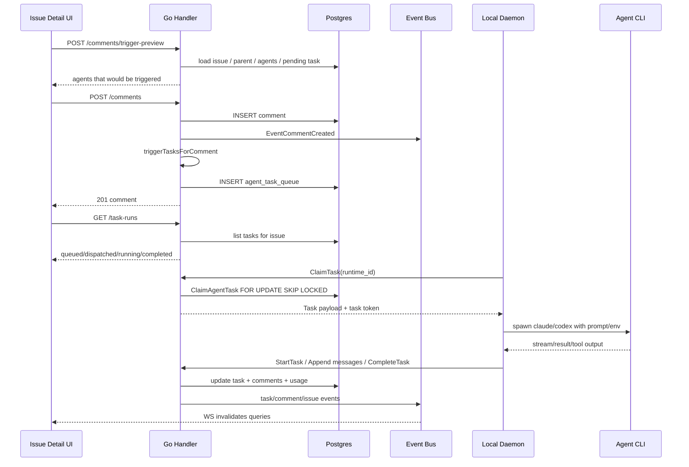

### 3.2 `trigger-preview`

前端：

- `packages/views/issues/hooks/use-comment-trigger-preview.ts`
- `packages/core/api/client.ts`

后端：

- `server/internal/handler/comment.go`
- `PreviewCommentTriggers`
- `computeCommentAgentTriggers`

作用：不写 comment、不入队，只告诉 UI“这条评论如果发出，会触发哪些 agent”。

伪代码：

```ts
useCommentTriggerPreview({ issueId, content }) {
    if content is empty or startsWith("/note") {
        return []
    }

    debounce 300ms
    POST /api/issues/:id/comments/trigger-preview
}
```

```go
func PreviewCommentTriggers(w, r) {
    issue := loadIssueForUser()
    req := decodeBody()
    parent := loadParentCommentIfAny()
    actor := resolveActor()

    triggers := computeCommentAgentTriggers(
        issue,
        req.Content,
        parent,
        actor,
    )

    writeJSON(triggers)
}
```

### 3.3 `POST /comments`

后端核心位置：

- `server/internal/handler/comment.go`
- `CreateComment`
- `triggerTasksForComment`
- `enqueueCommentAgentTriggers`

伪代码：

```go
func CreateComment(w, r) {
    issue := loadIssueForUser()
    req := decodeBody()
    parent := loadParentIfAny()
    authorType, authorID := resolveActor()

    comment := Queries.CreateComment(...)

    publish(EventCommentCreated, {
        comment,
        issue_title,
        issue_assignee_type,
        issue_assignee_id,
        issue_status,
    })

    TaskService.AutoUnresolveThreadOnReply(...)

    triggerTasksForComment(
        issue,
        comment,
        parent,
        authorType,
        authorID,
        suppressAgentIDs,
    )

    writeJSON(comment)
}
```

`triggerTasksForComment`：

```go
func triggerTasksForComment(...) {
    if isNoteComment(comment.Content) {
        return
    }

    triggers := computeCommentAgentTriggers(...)
    triggers = filterSuppressedCommentAgentTriggers(triggers, suppressAgentIDs)
    enqueueCommentAgentTriggers(issue, comment.ID, triggers)
}
```

`computeCommentAgentTriggers` 会合并三种来源：

```go
func computeCommentAgentTriggers(...) []commentAgentTrigger {
    if member comment should wake current issue assignee {
        add(issue assignee agent)
    }

    if issue assignee is squad and leader should wake {
        add(squad leader)
    }

    for each @agent / @squad mention {
        add(mentioned agent or squad leader)
    }

    dedupe by agent id
}
```

### 3.4 `EventCommentCreated` 的作用

`EventCommentCreated` 不是“执行 agent”的队列本身。它是事件广播，给这些系统用：

- WebSocket 推给前端，刷新 timeline。
- activity listener 生成活动记录。
- notification listener 生成 inbox。
- subscriber listener 维护订阅关系。

真正导致 agent 执行的是 `triggerTasksForComment -> enqueueCommentAgentTriggers -> TaskService.Enqueue... -> agent_task_queue`。

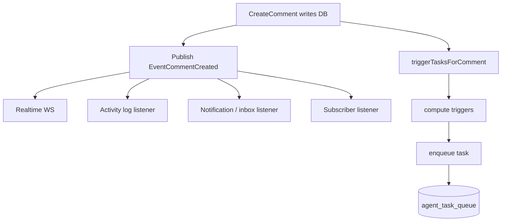

### 3.5 你截图里的接口解释

| 请求 | 角色 | 是否主链路 | 说明 |
| --- | --- | --- | --- |
| `comments/trigger-preview` | 预判 | 是 | 输入框发出前判断会唤醒谁 |
| `comments` POST | 写评论 | 是 | 创建 comment，并触发入队 |
| `comments` GET | 读 timeline | 辅助 | 刷新评论列表 |
| `task-runs` | issue 维度任务 | 是 | 右侧 Execution Log，看当前 issue 的 run |
| `agent-task-snapshot` | workspace 维度任务 | 是 | agent presence / working chip |
| `agents?workspace_id=...` | 元数据 | 辅助 | 渲染 agent 名字、头像、picker |
| `subscribers` | 订阅者 | 辅助 | issue 右侧订阅者列表 |
| `usage` | token/usage | 辅助 | issue 用量展示 |
| `inbox` | 通知列表 | 辅助 | 当前 workspace inbox |
| `unread-summary` | 跨 workspace 未读 | 辅助 | sidebar / workspace switcher dot |
| `notification-preferences` | 通知偏好 | 辅助 | 是否生成/展示通知 |

## 4. Event Bus 是什么

位置：

- `server/internal/events/bus.go`
- `server/cmd/server/main.go`
- `server/cmd/server/*_listeners.go`

它是 Go server 进程内的同步 pub/sub，不是 Kafka / Redis Stream。server 启动时注册 listeners，业务代码 `publish(...)` 后，同进程内的 listener 会收到。

```mermaid
flowchart LR
  Startup[server startup] --> Register[register listeners]
  Register --> Table[map eventType -> handlers]

  Handler[HTTP handler] --> Publish[bus.Publish(event)]
  Publish --> Copy[copy handler list under RLock]
  Copy --> Run[run handlers]
```

为什么读订阅表也要加锁：

- listener 表本质是 map/slice。
- Go map 并发读写不安全。
- 虽然大多数 listener 在启动时注册，但代码层面允许 `Subscribe` 在运行期调用。
- `Publish` 用 `RLock` 只保护“读取 handler 列表”这一小段，真正执行 handler 时已经释放锁。

所以它不是“所有事件执行都被一把锁串行化”。锁保护的是订阅表结构，不是业务 handler 执行。

## 5. Daemon / Runtime / CLI 执行链路

### 5.1 Multica 是 poll 模型，不是 server 主动 push task

我们之前以为 daemon 可能靠 WebSocket 长连接等 server push 任务。源码里更准确的说法是：

- daemon 有 heartbeat / websocket / wakeup 等机制，用于状态和提示。
- 真正 claim task 的核心是 daemon runtime poller 周期性调用 server claim。
- server 通过 DB claim 语义保证任务不重复。

位置：

- `server/internal/daemon/daemon.go`
- `runRuntimePoller`
- `server/internal/handler/daemon.go`
- `ClaimTaskByRuntime`
- `server/pkg/db/queries/agent.sql`
- `ClaimAgentTask`

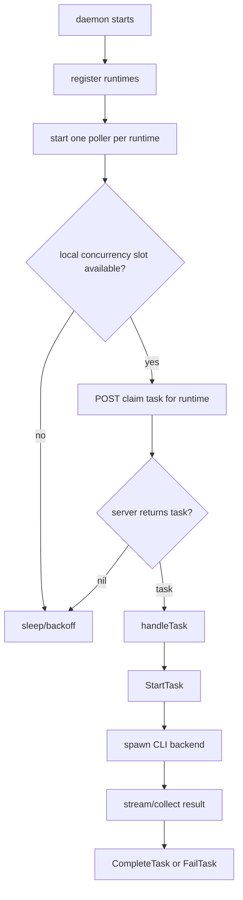

`runRuntimePoller` 的关键设计：

- 先拿本地并发 slot，再 claim，避免 claim 后排队太久导致 server dispatch timeout。
- runtime 消失时退出 poller，让 watcher 重建。
- claim 到 task 后 `handleTask` 异步处理。

### 5.2 Task payload 很厚

`server/internal/daemon/types.go` 的 `Task` 不只是 `task_id`，它携带了 daemon 启动 agent 所需的大量上下文：

- issue / workspace / project 信息
- workspace context
- repo / project resources
- prior session / prior workdir
- trigger comment / thread / author
- chat / autopilot / quick-create 信息
- squad 信息
- requesting user / initiator
- task-scoped `AuthToken`
- agent instructions / skills / custom env / args / model / MCP config

这说明 Multica 的 server 不是只做“队列分发”，还负责把任务 brief 和权限上下文组装成 daemon 可执行的 payload。

### 5.3 task token 是权限边界

daemon claim task 后拿到 task-scoped `AuthToken`。daemon 启动 CLI 时注入 `MULTICA_TOKEN`，agent 后续评论、改状态等 API 请求应该使用这个 task token，而不是 daemon 自己的 owner token。

核心边界：

- daemon token：用于 runtime 注册、heartbeat、claim。
- task token：用于 agent 执行当前任务时访问 Multica API。
- initiator 信息：告诉 agent“谁发起了这次任务”，但不是凭证。

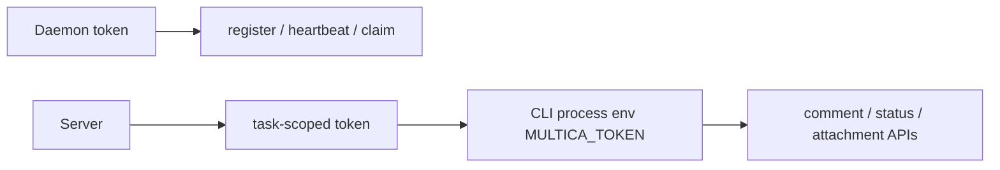

## 6. Multica 直接开 CLI 会话的优缺点

### 6.1 Claude Code

Multica 的 Claude backend 是通过 Claude CLI 的 stream-json 模式：

- `server/pkg/agent/claude.go`
- `--output-format stream-json`
- `--input-format stream-json`

这不是交互式终端 UI，而是用 CLI 提供的结构化流协议跑任务。

优点：

- 复用 Claude Code 已有能力：工具、权限、会话、模型、工作区语义。
- 接入成本比直接拼 Anthropic HTTP API 低。
- 本地用户已有登录态/配置时体验顺。
- stream-json 比纯 terminal text 更容易解析。

缺点：

- 仍受 CLI 稳定性、版本、输出协议影响。
- 工具审批、trace、事件粒度受 CLI 暴露能力限制。
- 进程生命周期、stdout/stderr、超时、resume 都要自己兜。
- 多 agent 编排时，统一抽象不够强，需要在 Multica 自己的 daemon 层补。

### 6.2 Codex

Multica 的 Codex backend 不是简单 `codex` TUI，而是：

- `server/pkg/agent/codex.go`
- spawn `codex app-server --listen stdio://`
- 通过 stdio 上的 JSON-RPC / app-server 协议交互。

这和“用户在终端打开 codex TUI”不是一回事。它更像启动一个本地 Codex 服务进程，然后 Multica daemon 作为 client 发送结构化请求。

优点：

- 比纯终端文本更结构化。
- 更适合做自动化任务执行。
- 可以拿到更细的事件和状态。

缺点：

- 依赖 Codex app-server 协议。
- 协议变化时 Multica backend 需要适配。
- 与 Claude stream-json、OpenCode、Hermes 等 backend 的事件形状仍不统一。

## 7. Omnigent 的分层：Harness Protocol vs Executor Interface

这块是我们今天反复绕的核心。

### 7.1 两条边界

Omnigent 有两层抽象：

1. Harness Protocol：server / runner 和某个 harness 进程之间的协议。
2. Executor Interface：harness 内部与具体模型/SDK/CLI 后端之间的接口。

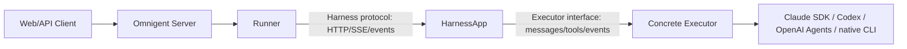

### 7.2 Harness Protocol 管什么

`omnigent/runtime/harnesses/_scaffold.py` 说明了 HarnessApp scaffold 管这些：

- 暴露 FastAPI app。
- 接受 `POST /v1/sessions/{conversation_id}/events`。
- 管每个 turn 的 in-memory state。
- 支持 message / interrupt / tool_result / approval。
- 发 heartbeat。
- 支持 cancellation。
- 处理 steering / injection。
- graceful shutdown。
- 给 policy evaluation 留通道。

Harness Protocol 的语义是“对外稳定”：runner 不关心里面是 Claude SDK、Codex、native CLI，runner 只看统一事件。

### 7.3 Executor Interface 管什么

`omnigent/inner/executor.py` 里定义：

- `ExecutorConfig`
- `Message`
- `ToolSpec`
- `ExecutorEvent`
- `TextChunk`
- `ReasoningChunk`
- `ToolCallRequest`
- `ToolCallComplete`
- `TurnComplete`
- `TurnCancelled`

Executor Interface 的语义是“对内适配”：把不同 provider SDK / CLI 的细节翻译成统一事件。

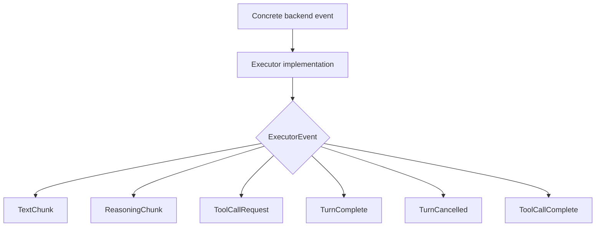

### 7.4 ExecutorAdapter 是中间翻译层

`omnigent/runtime/harnesses/_executor_adapter.py` 的作用是把任意 inner `Executor` 包装成 `HarnessApp`：

- 把 Omnigent `CreateResponseRequest` 转成 Executor 的 messages/config。
- 把 ExecutorEvent 转成 Omnigent SSE / wire events。
- 把工具调用桥接到 `ctx.dispatch_tool`。
- 把 cancellation 传播给 executor。
- 管 per-conversation executor 生命周期。

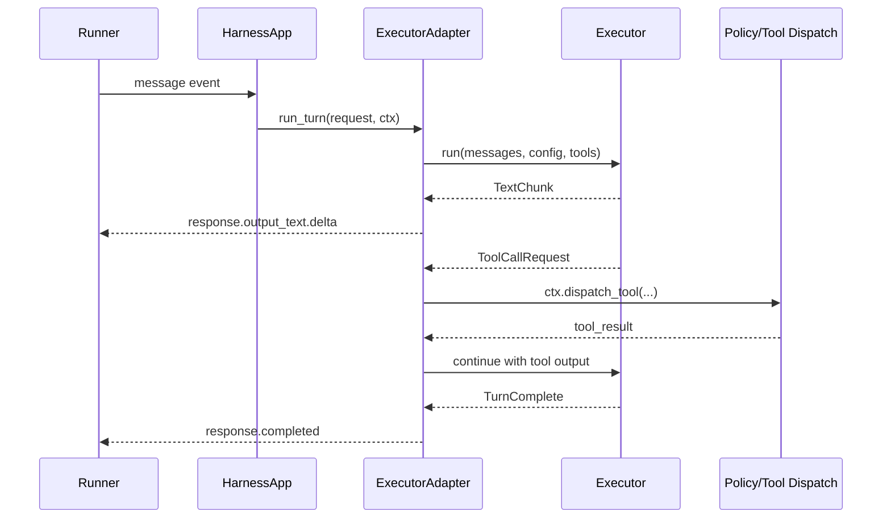

我们之前说的那句话可以修正成更精确版本：

> Harness protocol 到 Codex Harness，不一定只是一层 adapter；如果是 executor-backed harness，就会通过 `ExecutorAdapter` 把 Codex executor 的事件翻译成 HarnessApp 的事件。Codex 到 Harness Protocol 的方向，本质就是把 Codex/native/SDK 的事件翻译成 Omnigent 的 `ExecutorEvent` / SSE 事件，交给 policy、tool dispatch、UI 做统一处理。

## 8. Omnigent native / SDK / Multica CLI 的区别

### 8.1 Omnigent native

Omnigent native 更强调“保留终端体验 / 原生 CLI 会话”：

- 可能用 tmux / terminal session。
- 可以观察 terminal / native stream。
- web 通过外部事件同步 terminal 里发生的事。
- 适合用户希望继续拥有原生 TUI 手感的场景。

优点：

- 终端体验强。
- 用户可以直接介入原生 CLI。
- 对 Claude Code / Codex 这类本来有终端产品的工具更自然。

缺点：

- 事件抽取更难。
- UI 去重、stream 对齐、pending input reconciliation 更复杂。
- 统一工具审批和 trace 需要额外事件桥。

### 8.2 Omnigent SDK / executor-backed

SDK 模式更像“平台直接调 provider SDK / HTTP API / app-server”。

优点：

- 事件结构更统一。
- 工具审批更容易平台化。
- trace / policy / cost / usage 更容易统一。
- 更适合多 agent 编排和自动化。

缺点：

- 不一定保留原生终端体验。
- provider SDK 能力可能落后 CLI。
- 有些 CLI 独有能力要重做或桥接。

### 8.3 Multica 当前直接 CLI

Multica 当前是 daemon backend 里分别适配 Claude/Codex/OpenCode/Hermes 等：

- package：`server/pkg/agent`
- 各 backend 实现具体 CLI/protocol 交互。

它已经有“后端适配”的雏形，但还没有像 Omnigent 那样把 Harness Protocol、Executor Interface、Policy/Event/Trace 抽成平台层。

## 9. 用一个 Code + QA 双 agent 例子串 Omnigent

需求：

- code agent 在服务器 codex runtime，用 DeepSeek V4。
- qa agent 在本地 claude-code runtime，用 Gemini Flash。
- QA 每次 test pass 后飞书通知你。
- fail 后让 code 重写。
- code 只有拿到 QA pass 才能继续下一个开发任务。

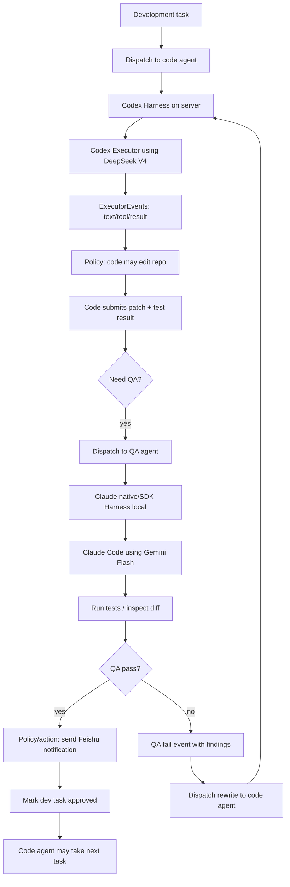

事件流伪代码：

```python
on task_created(kind="dev"):
    dispatch(agent="code", harness="codex", model="deepseek-v4")

on event(code, "turn.completed"):
    if code.changed_files:
        dispatch(agent="qa", harness="claude-code", model="gemini-flash")

on event(qa, "tests.passed"):
    policy.require("notify_feishu")
    feishu.send(...)
    mark_gate(task_id, "qa_passed")
    unlock_next_dev_task(code_agent)

on event(qa, "tests.failed"):
    create_followup(
        assignee="code",
        prompt=qa.findings,
        gate="must_pass_qa_before_next"
    )
```

这就是 Harness/Event/Policy 解耦的意义：

- code agent 和 qa agent 可以是不同 harness。
- policy 不关心底层是 Codex 还是 Claude。
- Feishu 通知是 policy/action，不应写死在某个 agent prompt。
- “QA pass 才能继续下一个任务”是调度 gate，不应该靠 agent 自觉。

## 10. 如果 Multica 要变成多 harness 多 runtime 平台，还缺什么

今天讨论下来，Multica 已经有这些基础：

- issue / agent / squad / runtime 基础模型。
- daemon 本地执行器。
- `agent_task_queue` 队列和 claim 语义。
- 多 provider backend 的具体实现。
- comment / issue / inbox / activity / realtime 业务闭环。
- task token 权限边界。

但离 Omnigent 式多 harness runtime 平台，还缺几层。

### 10.1 Harness interface

现在 `server/pkg/agent` 里是各种具体 backend 实现，但公共事件模型还不够“平台级”。

需要抽出类似：

```go
type Harness interface {
    StartTurn(ctx, request) (<-chan HarnessEvent, error)
    SubmitToolResult(ctx, callID, result) error
    Approve(ctx, requestID, decision) error
    Interrupt(ctx, turnID) error
    CloseSession(ctx, sessionID) error
}
```

事件统一成：

```go
type HarnessEvent struct {
    Type string // text_delta, tool_call, tool_result, usage, completed, failed...
    TaskID string
    SessionID string
    Payload json.RawMessage
}
```

### 10.2 Tool approval / policy engine

现在 Multica 更多是 daemon/CLI 自己处理工具执行。要平台统一审批，需要：

- 工具调用先变成 server 可见事件。
- server policy 判断 allow / ask / deny。
- ask 时 UI 能展示审批卡片。
- result 再回到 harness。

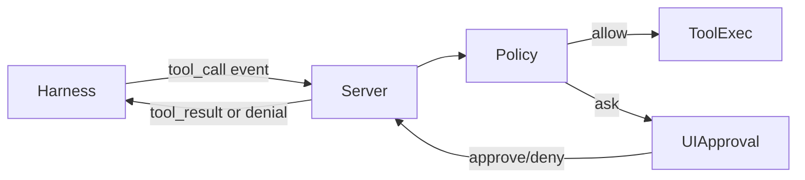

### 10.3 Fine-grained trace

需要把下面这些都记录成统一 trace：

- model request / response
- text delta
- tool call / tool result
- policy decision
- approval wait time
- task status edge
- cost / usage
- file changes / repo operation

否则多 agent 编排出问题时，只能看最终 comment，很难知道“谁在什么时候调用了哪个工具，为什么被允许”。

### 10.4 Multi-agent orchestration

Multica 当前 task 基本是“一个 issue 触发一个 agent run”。多 agent 平台需要显式编排对象：

- workflow / plan
- dependency graph
- gate
- role assignment
- shared artifacts
- retry policy
- escalation policy

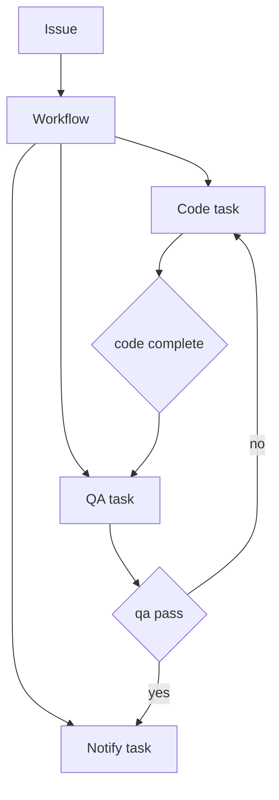

### 10.5 Runtime capability model

现在 provider/runtime 大致能表示 `codex`、`claude`，但多 harness 平台要更细：

- supports_terminal
- supports_stream_json
- supports_tool_approval
- supports_session_resume
- supports_model_switch
- supports_file_edit_trace
- supported_models
- auth mode
- sandbox mode

agent picker 和 scheduler 都应该基于 capability 选 runtime，而不是只看 provider string。

## 11. 本地调试地图

### 11.1 从 comment 触发 agent

建议断点顺序：

1. `server/internal/handler/comment.go`
   - `PreviewCommentTriggers`
   - `CreateComment`
   - `triggerTasksForComment`
   - `computeCommentAgentTriggers`
   - `enqueueCommentAgentTriggers`

2. `server/internal/service/task.go`
   - `EnqueueTaskForIssue`
   - `EnqueueTaskForMention`
   - `EnqueueTaskForSquadLeader`

3. `server/internal/handler/daemon.go`
   - `ClaimTaskByRuntime`
   - `requireDaemonRuntimeAccess`

4. `server/internal/daemon/daemon.go`
   - `runRuntimePoller`
   - `handleTask`

5. `server/pkg/agent/claude.go` / `server/pkg/agent/codex.go`
   - CLI spawn / stream parse / final result

### 11.2 判断任务有没有入队

看 `agent_task_queue`：

```sql
SELECT id, agent_id, runtime_id, issue_id, status, trigger_comment_id, created_at, dispatched_at, started_at, completed_at, error
FROM agent_task_queue
ORDER BY created_at DESC
LIMIT 20;
```

状态含义：

- `queued`：server 已入队，daemon 还没 claim。
- `dispatched`：daemon 已 claim，理论上马上 start。
- `running`：daemon 已通知开始执行。
- `completed`：成功。
- `failed`：失败，看 `error`。
- `cancelled`：被取消或 reassignment 清掉。

### 11.3 前端看哪些接口

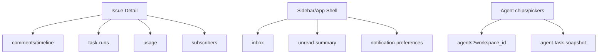

## 12. Docker / Harbor / K8s 部署经验

这几天还做了本地镜像推 Harbor 和 K8s 测试部署。关键经验：

- 公司环境不依赖 Docker Desktop，优先用 Colima / Podman / crane。
- Harbor push 格式：

```bash
docker tag SOURCE_IMAGE[:TAG] harbor.weizhipin.com/lc-test/REPOSITORY[:TAG]
docker push harbor.weizhipin.com/lc-test/REPOSITORY[:TAG]
```

- M1/M2 Mac 默认 build/pull 容易得到 arm64 镜像。
- 公司 K8s 集群如果是 amd64，就要显式 build/pull/push linux/amd64。
- 多平台镜像如果在 arm64 机器上 plain pull + push，Harbor 里可能只剩 arm64 单平台 manifest，amd64 集群拉不动。
- 这个流程已沉淀到 `.agents/skills/harbor-image-mirror/SKILL.md`。

## 13. 明早继续看的推荐顺序

先从当前正在调的 `@agent comment` 链路继续：

1. 在 `CreateComment` 确认 comment 成功落库。
2. 在 `computeCommentAgentTriggers` 看 triggers 是否包含目标 agent。
3. 在 `enqueueCommentAgentTriggers` 看走的是 mention 还是 issue assignee。
4. 在 `agent_task_queue` 看是否出现新 row。
5. 在 daemon 的 `runRuntimePoller` 看是否 claim 到这条 task。
6. 在 `server/pkg/agent/claude.go` 或 `codex.go` 看具体 CLI 是否启动。
7. 回到前端看 `task-runs` 和 `agent-task-snapshot` 是否刷新。

再看架构升级：

1. Multica 当前 `server/pkg/agent` 的 backend 公共部分。
2. Omnigent `HarnessApp` scaffold。
3. Omnigent `Executor` interface。
4. Omnigent `ExecutorAdapter` 如何翻译 event。
5. 对比后设计 Multica 的 `HarnessEvent` / `Harness` interface。

## 14. 最重要的几个判断

- `EventCommentCreated` 是通知/同步事件，不是 task queue 本身。
- `trigger-preview` 是预判，不入队。
- `POST /comments` 后的 `triggerTasksForComment` 才是真正入队入口。
- daemon claim 是 poll 模型，靠 DB 的 `FOR UPDATE SKIP LOCKED` 防重复。
- runtime 的 `provider` 是执行后端类型，不是创建者。
- Claude stream-json / Codex app-server 都比纯 terminal 文本结构化，但还不是统一 harness event。
- Omnigent 的核心价值是把“不同 agent 后端”翻译成统一 event，再让 policy / tool approval / trace / UI 复用。
- Multica 如果要做多 harness 平台，最该补的是统一 Harness interface、事件规范、policy/approval、trace、workflow/gate。

