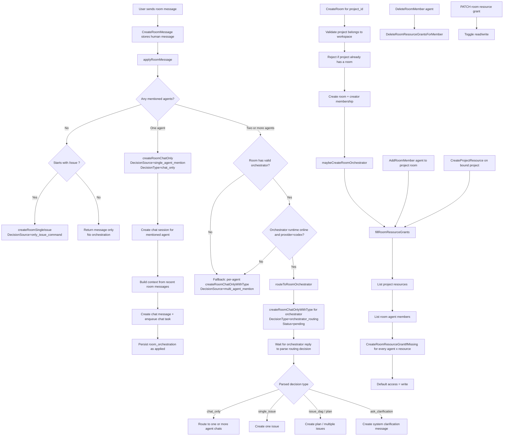

# Room Chat Handoff

Date: 2026-07-03

## Scope

This handoff summarizes the new `room-chat` flow implemented in [room.go](/Users/admin/code/multica/server/internal/handler/room.go) for:

- project-bound rooms (`workspace_room.project_id`)
- multi-agent collaboration inside one room
- shared project resources and repo context across those agents

Related resource hook: [project_resource.go](/Users/admin/code/multica/server/internal/handler/project_resource.go:257)

## Core model

- A room can now optionally bind to one project via `project_id`.
- A project can have at most one bound room.
- Agents added to that room inherit access to all project resources through `room_resource_grant`.
- Project resources include durable repo/resource context such as `github_repo` and `local_directory`.
- The room orchestrator is used only when multiple agents are mentioned and the orchestrator runtime is online and Codex-backed.

## Flowchart

## What this means operationally

- `CreateRoom` now supports `project_id` and enforces one-room-per-project before insert, with DB uniqueness still acting as the race-safe backstop.
- `fillRoomResourceGrants` is the convergence point for shared resource access:
  - after project room creation
  - after adding an agent to the room
  - after adding a new project resource to the bound project
- The backfill is intentionally idempotent and non-fatal:
  - `ON CONFLICT DO NOTHING`
  - errors are logged and swallowed
  - admin-downgraded `read` grants are preserved
- Removing an agent from a room deletes that agent’s room-scoped resource grants.
- Admins can inspect the room access matrix with `ListRoomResourceGrants` and change a row with `UpdateRoomResourceGrant` (`read` or `write` only).

## Message routing details worth preserving

- Mention parsing is name-based via `@agent-name`, matched against current room agent members.
- Single-agent mention always creates a direct chat task for that agent.
- Multi-agent mention prefers the room orchestrator, but only if:
  - `room.OrchestratorAgentID` is set
  - the orchestrator agent exists and is not archived
  - runtime is online
  - runtime provider is `codex`
- If the orchestrator is unavailable, the handler falls back to fan-out chat creation for each mentioned agent instead of blocking the room.
- Chat context is built from recent room messages, excluding:
  - the current message
  - system messages

## Shared repo/resource behavior

- Project resources are the durable source of shared context for project-based rooms.
- Because every room agent gets room grants for every project resource, agents collaborating in the same room can all inherit the same repo/resource set.
- The repo-sharing behavior is indirect here:
  - the room handler manages grant materialization
  - downstream task/runtime code consumes project resources when building task context
- The hook in [project_resource.go](/Users/admin/code/multica/server/internal/handler/project_resource.go:321) is what keeps newly added project repos/resources visible to existing room agents without manual room edits.

## Likely next places to inspect

- [room.go](/Users/admin/code/multica/server/internal/handler/room.go)
- [project_resource.go](/Users/admin/code/multica/server/internal/handler/project_resource.go:257)
- [router.go](/Users/admin/code/multica/server/cmd/server/router.go:802)
- [agent.go](/Users/admin/code/multica/server/internal/handler/agent.go:204)
- [context.go](/Users/admin/code/multica/server/internal/daemon/execenv/context.go:78)
- [runtime_config.go](/Users/admin/code/multica/server/internal/daemon/execenv/runtime_config.go:216)

## Open questions for the next agent

- Where exactly is the orchestrator reply parsed into `chat_only` / `single_issue` / `issue_dag` / `plan` / `ask_clarification` after the pending `orchestrator_routing` row is created?
- Is there test coverage for:
  - project room creation conflict on duplicate `project_id`
  - agent add/remove grant backfill and cleanup
  - project resource add causing room grant backfill
  - orchestrator unavailable fallback to per-agent chat
- Does the UI already expose `resource-grants` for room settings, or is backend support ahead of UI?

## Suggested skills

- `handoff`: continue compacting future discoveries into a fresh next-session brief
- `diagnosing-bugs`: if the next session is about why grants/repos are not reaching agent runtimes
- `domain-modeling`: if the next session needs to clarify the contract between room, project, resource, grant, and task context
