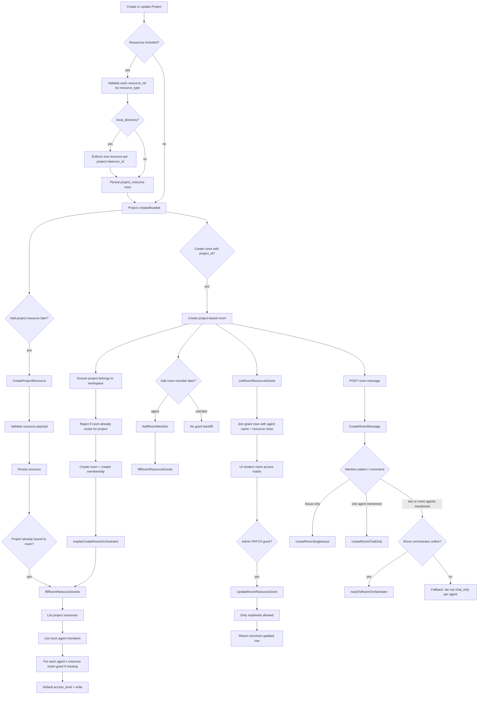

# Room / Project Resource Flow (Recent 5h)

Scope: summarize the effective changes and current behavior around these files within the last 5 hours, using current workspace state plus recent git history.

- `server/cmd/server/router.go`
- `server/internal/handler/project_resource.go`
- `server/internal/handler/room_resource_grant_test.go`
- `server/internal/handler/project.go`
- `server/internal/handler/room.go`

## What changed

1. `project.go`
   Added project resource awareness to project APIs:
   - `ProjectResponse.ResourceCount`
   - bundled resource creation in `CreateProjectRequest.Resources`
   - `ListProjects?without_room=true` for the "create room from project" picker

2. `project_resource.go`
   Added/extended project resource CRUD with validation for:
   - `github_repo`
   - `local_directory`

   Added daemon-scoped uniqueness for `local_directory`: one `local_directory` per `(project, daemon_id)`.

   Added hook: when a resource is added to a project that already has a bound room, backfill room resource grants.

3. `room.go`
   New room handler file implementing:
   - project-based room creation via `project_id`
   - room member management
   - room message creation and orchestration
   - room resource grant list/update APIs
   - backfill helper `fillRoomResourceGrants`

4. `room_resource_grant_test.go`
   Added end-to-end test covering the grant lifecycle for project-based rooms.

5. `router.go`
   Wired new routes for:
   - room resource grants
   - project resources

## Flowchart

## Handler-level flow notes

### 1. Project resource creation

Entry: `CreateProjectResource` in [project_resource.go](/Users/admin/code/multica/server/internal/handler/project_resource.go)

Behavior:
- loads project and checks workspace ownership
- validates `resource_type`
- normalizes `resource_ref`
- for `local_directory`, rejects another row on the same `daemon_id`
- persists the resource
- if the project already has a room, calls `fillRoomResourceGrants(room.ID, project.ID)`

Key consequence:
- project resource creation is now a room-level side effect when the project is already room-bound

### 2. Project creation with inline resources

Entry: `CreateProject` in [project.go](/Users/admin/code/multica/server/internal/handler/project.go)

Behavior:
- supports `resources[]` on create
- validates all resource payloads before opening the write transaction
- enforces `local_directory` uniqueness inside the request batch
- stores resources together with the project

Key consequence:
- a new project can be provisioned with git/local resources in one request, then room creation can bind to that prepared project

### 3. Project-based room creation

Entry: `CreateRoom` in [room.go](/Users/admin/code/multica/server/internal/handler/room.go)

Behavior:
- optional `project_id`
- validates that the project exists in the same workspace
- rejects duplicate room-per-project
- creates room, creator membership, and room orchestrator
- if `project_id` is present, immediately backfills grants for current room agents against all project resources

Key consequence:
- room and project are now explicitly bound, and resource access is initialized at room creation time

### 4. Grant backfill invariant

Entry: `fillRoomResourceGrants` in [room.go](/Users/admin/code/multica/server/internal/handler/room.go)

Invariant:
- every agent in a project-based room should have a `room_resource_grant` for every project resource
- default access is `write`
- implementation is idempotent via `CreateRoomResourceGrantIfMissing`
- errors are logged and swallowed; parent operation does not fail

Triggered from:
- `CreateRoom`
- `AddRoomMember` for agent members
- `CreateProjectResource`

Key consequence:
- the system converges toward a complete room/resource/agent matrix without forcing manual admin steps first

### 5. Grant management surface

Entries in [room.go](/Users/admin/code/multica/server/internal/handler/room.go):
- `ListRoomResourceGrants`
- `UpdateRoomResourceGrant`

Behavior:
- list API enriches DB rows with agent name and resource metadata
- patch API only allows `read` / `write`
- update response is also enriched so UI can patch cached state directly

Key consequence:
- admin can downgrade a single agent/resource pair without breaking the default backfill model

### 6. Room chat orchestration path

Entry: `CreateRoomMessage` and `applyRoomMessage` in [room.go](/Users/admin/code/multica/server/internal/handler/room.go)

Routing rules:
- `/issue ...` with no mentions -> create issue
- one agent mention -> `chat_only` to that agent
- multiple agent mentions:
  - if room orchestrator is online codex runtime -> route to orchestrator
  - otherwise fallback to per-agent `chat_only`

Key consequence:
- project-based room is not only a resource container; it is also the message router for multi-agent collaboration

## Route surface added / relevant

In [router.go](/Users/admin/code/multica/server/cmd/server/router.go):

- `GET /api/rooms/{roomId}/resource-grants`
- `PATCH /api/rooms/{roomId}/resource-grants/{grantId}`
- `POST /api/projects/{id}/resources`
- `PUT /api/projects/{id}/resources/{resourceId}`
- `DELETE /api/projects/{id}/resources/{resourceId}`

`ListProjects?without_room=true` is also relevant on the project list path for room creation UX.

## Test coverage added

Primary test: [room_resource_grant_test.go](/Users/admin/code/multica/server/internal/handler/room_resource_grant_test.go)

Covered path:
- create project
- attach project resource
- create room with `project_id`
- add agent member
- verify default `write` grant exists
- add another project resource
- verify new resource grant backfills
- patch one grant to `read`
- verify unrelated grant remains `write`
- create second room for same project -> expect `409`
- `ListProjects?without_room=true` no longer returns that project

## Current state / implementation status

Done:
- project resource CRUD is wired
- project create supports inline resources
- project-based room creation is wired
- room resource grant APIs are wired
- automatic grant backfill is implemented on the three important hooks
- room chat mention routing is present in the new handler
- regression/integration-style grant test exists

Still to verify / likely next work:
- end-to-end UI/API path that creates a project-based room from the frontend
- daemon/runtime side consumption of room resource grants when agents actually execute tasks
- whether room orchestrator and executor agents both receive the intended repo/local-directory materialization at runtime
- cleanup semantics when deleting a project resource and how existing tasks react
- broader tests around multi-agent mention + project resources together

## Handoff guidance for next agent

Start from these entry points:
- [room.go](/Users/admin/code/multica/server/internal/handler/room.go)
- [project_resource.go](/Users/admin/code/multica/server/internal/handler/project_resource.go)
- [project.go](/Users/admin/code/multica/server/internal/handler/project.go)
- [router.go](/Users/admin/code/multica/server/cmd/server/router.go)
- [room_resource_grant_test.go](/Users/admin/code/multica/server/internal/handler/room_resource_grant_test.go)

If the next step is runtime integration, the key question is not API shape anymore. The key question is: when a room message turns into a task for an agent, where does the task assembly pipeline read `room_resource_grant` and merge allowed `project_resource` rows into the runnable task context.
